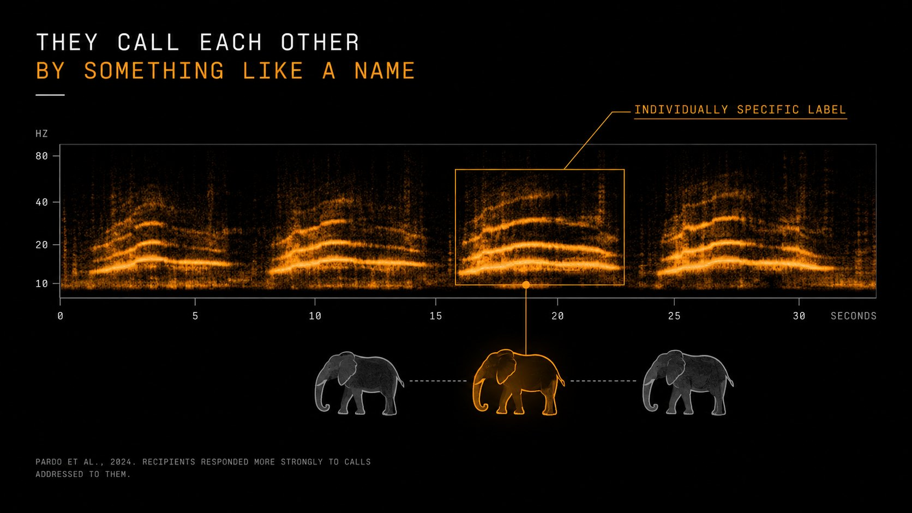
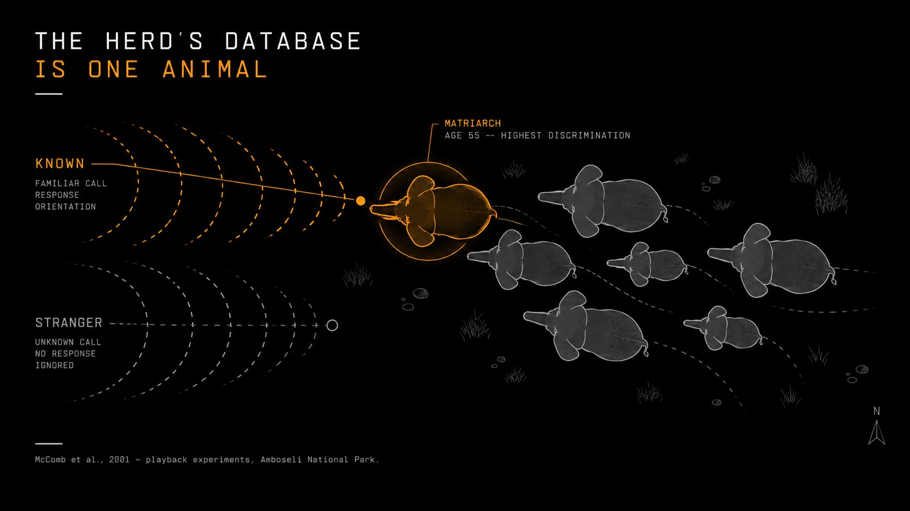

<div align="center">


**ELEPHANTBRAIN** is a terminal for token memory.

Paste a contract address and see what the market forgets: the deployer's history, the wallets connected to it, the wallets that move together, and the large positions shifting before price does.

A deployer drains a pool, makes a new wallet, launches under a new name — and the market treats it as a stranger. ELEPHANTBRAIN remembers who is who.

node 18+ · three chains · four memory modules · MIT

</div>

---

## The thirty seconds

```
git clone https://github.com/andreysuperiorgit/elephantbrain.git && cd elephantbrain
npm install && cd client && npm install && cd ..
cp .env.example .env

npm run dev
```

```
  elephantbrain v0.4.0 · token memory terminal · http://localhost:3000

  ● Solana     Pump.fun → Jupiter
  ● Robinhood  Pons V2  → Uniswap V4
  ● Base       Clanker  → Uniswap V3

  second brain:  0 tokens seen — it starts empty and learns as you run it
  elephantbrain: deployer memory · herd map · alerts · matriarch score

  listening.
```

Open **localhost:3000** and paste any contract address. Or let it watch — every new launch gets scanned, scored, and remembered the moment it appears.

---

## What it is

Three things that usually live apart, in one dashboard.

**A scanner.** Six on-chain checks, weighted and scored 0–100. Mint authority, freeze authority, holder concentration, bundle detection, LP lock status, metadata flags. Each answers one question: can the creator take your money?

**A sniper.** When a token clears your threshold, ELEPHANTBRAIN buys through Jupiter or Uniswap before the crowd arrives. When it fails, ELEPHANTBRAIN skips and tells you why. No manual decisions at 3 AM.

**A memory.** Every deployer, wallet, and token ELEPHANTBRAIN has ever scanned, kept on your disk. The system gets sharper the longer it runs. That is the **Second Brain**.

---

## ELEPHANTBRAIN

An elephant carries around 257 billion neurons and there is no wiring map for any of them. What it is known for is memory — recognising who is who, across years, even when the context changes. The market has none: a deployer drains a pool, makes a new wallet, launches under a new name, and every address is treated as a stranger.

Its memory works in four modules. Paste a contract address and see what the market forgets.



**Deployer Memory** — the launch history behind a token, how old the address is, and the addresses it keeps company with: who funded it, who shares its funder, which wallets buy early on its launches. Every link carries a confidence and the reason.



**Herd Map** — wallets that move together: buying in the same blocks on different tokens, selling together, drawing money from the same source. Clustered, with 3D positions for the dashboard.

**Low-Frequency Alerts** — large movements before price does anything: one big trade, quiet accumulation, quiet distribution, liquidity leaving the pool.

**Matriarch Score** — how experienced a wallet is: age, breadth, how its past picks turned out, and whether it keeps showing up in the first block of things that die.

```sh
npm run elephant -- <contract>
npm run demo                      # a small scenario in its own database
```

```
  ELEPHANTBRAIN  0xlaptop…0000  base · live · DANGER
────────────────────────────────────────────────────────────────
  Deployer has 5 launches in memory: 3 died, 1 survived.
  4 related addresses with confidence ≥ 0.6.
  Largest coordinated group: 3 wallets, 1 flagged.
  1 low-frequency alert on this token.
  Wallets around it average a Matriarch Score of 27.

DEPLOYER MEMORY
────────────────────────────────────────────────────────────────
  0xd70000…0000   serial   0d observed
    0xold000…0000  rugged    CAUTION
    0xold100…0000  rugged    CAUTION
    0xold200…0000  rugged    CAUTION
    0xold300…0000  alive     CAUTION
    0xlaptop…0000  live      DANGER
  0.92  0xc20000…0000  shares a funder (0xboss0000…); early buyer on 5 of its 5 launches
  0.80  0xboss00…0000  funded this deployer (manual)
  0.80  0xc10000…0000  early buyer on 5 of its 5 launches
  0.80  0xc30000…0000  early buyer on 5 of its 5 launches

HERD MAP
────────────────────────────────────────────────────────────────
  4 wallets · 3 links · 1 groups
  group 0: 3 wallets, 1 flagged
    0xc10000…0000 ↔ 0xc20000…0000  bought within 2 blocks on 5 token(s)
    0xc10000…0000 ↔ 0xc30000…0000  bought within 2 blocks on 5 token(s)
    0xc20000…0000 ↔ 0xc30000…0000  bought within 2 blocks on 5 token(s)

LOW-FREQUENCY ALERTS
────────────────────────────────────────────────────────────────
  large_move       sell of $48,000 — 53.3% of liquidity

MATRIARCH SCORE
────────────────────────────────────────────────────────────────
  average of wallets around it: 27
    0xx90000…0000   41  HERD      thin record
    0xc20000…0000   26  CALF      partial
    0xc30000…0000   26  CALF      partial
    0xc10000…0000   15  OUTSIDER  partial

  Does not predict prices.  Does not guarantee safety.  Links and clusters are probabilistic, not forensic.
```

What it does not do: it does not predict prices, it does not guarantee safety, and it does not simulate neurons. Links between addresses are probabilistic, not forensic. The full design, the science behind each module and the honest gaps are in **[docs/ELEPHANTBRAIN.md](docs/ELEPHANTBRAIN.md)**.

---


## The Second Brain

The six checks tell you what a token **is right now**. The Second Brain tells you what the people behind it have **done before**.

A contract scan is a snapshot. A competent rugger passes all six checks every single time — that is the point of being competent. What they cannot hide is the pattern across launches: the same funding wallet, the same LP-pull timing, the same three bot wallets in the first block.

Every scan writes to a local SQLite file. Every future scan reads from it.

### What it tracks

**Deployers.** Every address that created a token ELEPHANTBRAIN scanned. How many they launched, how many rugged, how many are still alive. A deployer with 3 rugs and no survivors starts at **−15** before a single check runs.

**Wallets.** Addresses that appeared in bundle buys. Addresses tagged `smart_money`. Addresses flagged `known_rugger`. When they show up in a new token's first buys, ELEPHANTBRAIN already knows them.

**Tokens.** Everything ELEPHANTBRAIN has seen, with its score, verdict, and later status. `updateTokenStatus()` marks each as `live` / `rugged` / `abandoned`. That feedback loop is what turns deployer reputation into something real instead of a guess.

### The adjustment

Memory moves the score by up to **±25**.


The contract score is where the question starts, not the answer.

```
serial rugger · deployer 0x4c…9a · 3/3 rugged            → −15
2 known-rugger wallets in first buys                      → −10
smart money bought in the first three blocks              → +10
trusted deployer · 5/6 tokens alive after 30 days         → +10
```

A token scoring 78 on-chain with −18 from memory lands at 60 — **CAUTION**, not **SAFE**. Same contract, same six checks, different answer.

### Your data, your disk

The database lives at `data/memory.db`. Override with `EB_MEMORY_PATH`. It is plain SQLite, so query it directly:

```sh
sqlite3 data/memory.db "SELECT address, tokens_rugged, tokens_total
                        FROM deployers
                        WHERE tokens_rugged >= 3
                        ORDER BY tokens_rugged DESC LIMIT 20;"
```

Or use the CLI:

```sh
npm run memory:stats                          # top ruggers, smart money, totals
npm run memory:flag -- --address 0x… \
                     --chain base \
                     --smart "wallet from @proof_of_pizza"
```

Nothing leaves your machine. No telemetry, no shared database, no analytics ping. Want to share intel with a team? Copy the `.db` file.

---

## Keeping it honest

A scan tells you what a token looked like at birth. The follow-up job goes
back at 24h, 72h and 7d and records what actually happened to it.

```sh
npm run followup                # one pass
npm run followup -- --dry-run   # show what it would decide
npm run followup -- --watch     # keep running
```

This is the part that makes reputation mean anything. With it off,
`tokens_rugged` never increments, every deployer keeps a neutral record,
and the memory fills with rows while learning nothing. It runs with the
server by default.

A token is called rugged when price is 90% off its peak **and** liquidity
is under $2,000. Either alone is noise. Details and the honest gaps are in
[`docs/MEMORY.md`](docs/MEMORY.md).

---

## Schema migrations

The database is meant to live for months, so schema changes go through
versioned migrations rather than a fresh file.

```sh
npm run memory:migrate -- --status
```

They run automatically on boot.

---

## Docker

```sh
docker compose up --build
```

The memory database lives on a named volume. Mount something on `/data`
or the run's history dies with the container.

---

## The idea

Every chain has a block explorer. None of them tell you whether to click buy. None of them tell you the deployer already rugged three tokens this month.

66.8% of Pons V2 wallets lost money. 80% of $LAPTOP buyers lost money. Those are not outliers — that is the base rate when you trade on vibes.

ELEPHANTBRAIN runs six checks, asks the Second Brain what it remembers, and produces a number. The number is not a prediction. It measures how many escape hatches the creator left open, and how often they have used them before.

---

## The six checks

Because a score without a method is a guess.

| # | what it checks | weight | what it catches |
|:---:|:---|:---:|:---|
| 1 | mint authority | 20 | creator can print unlimited tokens |
| 2 | freeze authority | 15 | creator can freeze your wallet — honeypot |
| 3 | holder concentration | 20 | top 10 wallets hold too much supply |
| 4 | bundle detection | 20 | coordinated first buys from related wallets |
| 5 | LP status | 15 | liquidity not locked or burned |
| 6 | metadata flags | 10 | suspicious name, supply, or contract code |
| + | **second brain** | **±25** | **who the deployer is and what they did before** |

**80+** relatively clean · **60–79** caution · **40–59** warning · **below 40** danger

Weights live in `src/config/scoring.js`; each check's rule is in `src/scoring/checks.js`. Change them and the scores change. Nothing hides behind a model.

---

## The terminal

The dashboard at **localhost:3000**. The header carries the pulse at all times:

```
A E G I S  ·  3 chains  ·  scanning  ·  2,847 seen  ·  312 deployers tracked  ·  3 sniped
```

One rule for colour: **cyan** is being scanned, **green** is clean, **gold** needs attention, **red** will take your money, **purple** is what memory remembers. If every pane glowed, none of them would mean anything.

```
1  SCAN       the token, every check                  enter scan
2  SCORE      the breakdown, bar by bar               s snipe
3  MONITOR    live feed from all chains               c chains
4  MEMORY     what the second brain adds              m memory
5  PULSE      the numbers — clean, rug, ratio         r review
```

---

## The $LAPTOP case

September 9, 2026. Hunter Biden launched $LAPTOP on Base. It hit $199, then crashed to $0.87 in ninety minutes. $48K of liquidity backing a $144B fully diluted valuation. 80% of buyers lost money.

ELEPHANTBRAIN would have scored it **below 20** and auto-skipped:

```
→ scanning $LAPTOP on Base (chain 8453)

  mint_authority:       ACTIVE                    ✗  20/20 → 0
  freeze_authority:     ACTIVE                    ✗  15/15 → 0
  holder_concentration: 68.2% top 10              ✗  20/20 → 0
  bundle_detection:     4 coordinated wallets     ✗  20/20 → 0
  lp_locked:            0%                        ✗  15/15 → 0
  metadata:             suspicious ($144B FDV)    ⚠  10/10 → 4

  base score:           4/100

→ second brain: −10
  2 known-rugger wallets in first buys

→ final score: 0/100 — DANGER
→ action: SKIP
```

100M tokens (10% of supply) went to the project wallet before launch. 42.5M were dumped by an insider at open. Market makers held tokens days before public trading. Every one of those is a check ELEPHANTBRAIN runs, and every one failed.

The two wallets that dumped had appeared in three other rugs that week. The Second Brain remembered them.

That is not hindsight. That is six `if` statements and a lookup.

---

## The chains

```
network              chain id    launchpad       DEX
─────────────────────────────────────────────────────
Solana               —           Pump.fun        Jupiter
Robinhood Chain      4663        Pons V2         Uniswap V4
Base                 8453        Clanker         Uniswap V3
```

Each chain has its own monitor, scanner, and sniper. They share a score engine, one Second Brain, and one dashboard. A deployer caught rugging on Base is already known when they appear on Solana.

---

## Grok

Optional. After each scan, results go to xAI's Grok for a plain-language risk breakdown — what is wrong, what is right, BUY / CAUTION / AVOID with reasons.

Free $175/month API credits from xAI. Each scan costs about $0.0001.

```json
{
  "analysis": "Extremely high risk. Mint authority active. Freeze functions
               in bytecode. Top wallet holds 10% with pre-launch allocation.
               $48K liquidity backing $144B FDV. Second Brain flags 2
               known-rugger wallets in the first buys.",
  "recommendation": "AVOID",
  "confidence": "HIGH",
  "red_flags": [
    "Active mint authority",
    "Freeze/pause in contract",
    "42.5M tokens pre-allocated",
    "$48K vs $144B FDV",
    "Known-rugger wallets buying"
  ],
  "green_flags": []
}
```

Delete `src/ai/grok.js` and everything else still works. The scanner does not need a language model to count wallets.

---

## The API

```bash
# Scan — response includes the memory adjustment
curl http://localhost:3001/api/scan/solana/TOKEN_ADDRESS
curl http://localhost:3001/api/scan/robinhood/0xTOKEN
curl http://localhost:3001/api/scan/base/0xTOKEN

# Second Brain
curl http://localhost:3001/api/memory/stats
curl http://localhost:3001/api/memory/deployer/0xDEPLOYER

# ELEPHANTBRAIN
curl http://localhost:3001/api/elephant/base/0xTOKEN
curl http://localhost:3001/api/elephant/wallet/0xWALLET
curl http://localhost:3001/api/elephant/alerts?token=0xTOKEN

# Monitoring
curl -X POST http://localhost:3001/api/monitor/start \
  -H "Content-Type: application/json" -d '{"chain":"solana"}'
```

```
method  endpoint                       what it does
───────────────────────────────────────────────────────────────
GET     /api/scan/solana/:address      scan a Solana token
GET     /api/scan/robinhood/:address   scan a Robinhood Chain token
GET     /api/scan/base/:address        scan a Base token
GET     /api/memory/stats              second brain totals
GET     /api/memory/deployer/:addr     deployer history
GET     /api/elephant/:chain/:address  ELEPHANTBRAIN report
GET     /api/elephant/wallet/:addr     Matriarch Score
GET     /api/elephant/alerts           low-frequency alerts
POST    /api/elephant/activity         feed a movement, raise alerts
POST    /api/elephant/funding          record who funded whom
GET     /api/monitor/status            monitor status
POST    /api/monitor/start             start chain monitor
POST    /api/monitor/stop              stop chain monitor
WS      /ws                            live event stream
```

Every scan response carries memory:

```jsonc
{
  "chain": "base",
  "mint": "0x…",
  "baseScore": 78,
  "memory": {
    "adjustment": -18,
    "reasons": [
      "serial rugger: 3/3 tokens died",
      "2 known-rugger wallets in first buys"
    ],
    "deployer": { "tokens_total": 3, "tokens_rugged": 3 }
  },
  "finalScore": 60,
  "verdict": "CAUTION"
}
```

---

## On disk

```
elephantbrain/
├── src/
│   ├── chains/        one folder per chain, plus evm/ shared by Base and Robinhood
│   ├── scoring/       the six checks, the sum, the verdict bands
│   ├── config/        chain addresses and the scoring table
│   ├── memory/        SQLite store, one migration file per schema version
│   ├── modules/       deployer-memory · herd-map · low-frequency · matriarch
│   ├── terminal/      inspect(contract), ingestion, formatting
│   ├── api/           scan pipeline, routes, WebSocket
│   ├── jobs/          the follow-up loop
│   ├── sniper/        off by default
│   ├── ai/            optional Grok
│   └── utils/
├── scripts/           the npm run commands
├── tests/             one folder per area — 92 tests
├── examples/          a demo, curl calls, real JSON output
├── docs/              one page per memory module, API, configuration
├── assets/            the images on this page
└── client/            React + Vite dashboard
```

The full tree with a note on every folder: **[docs/STRUCTURE.md](docs/STRUCTURE.md)**.

No build step beyond `npm install`. The client is Vite + React, the server is Express, the scanners are plain functions that take an address and return a score, and the memory is one SQLite file.

---

## Configuration

```
variable              required   default          what it does
──────────────────────────────────────────────────────────────────
SOLANA_RPC_URL        ✓          public RPC       Solana HTTP endpoint
SOLANA_WS_URL         ✓          public WS        Solana WebSocket
ROBINHOOD_RPC_URL     —          public RPC       Robinhood Chain (4663)
BASE_RPC_URL          —          public RPC       Base (8453)
EB_MEMORY_PATH        —          data/memory.db   where memory lives
EB_FOLLOWUP           —          on               set "off" to stop the loop
EB_FOLLOWUP_MINUTES   —          30               minutes between passes
EB_PRICE_SOURCE       —          dexscreener      or "none" for no network
EB_LARGE_MOVE_USD     —          25000            one trade that is an alert
EB_FLOW_USD           —          15000            hourly net flow that is an alert
XAI_API_KEY           —          —                Grok (console.x.ai)
SNIPER_ENABLED        —          false            ⚠ uses real funds
PORT                  —          3001             server port
```

`cp .env.example .env` and fill in the keys you have. Every variable is explained in **[docs/CONFIGURATION.md](docs/CONFIGURATION.md)**. Everything without a ✓ falls back to a default. The Second Brain needs no setup — SQLite creates the file on the first scan.

---

## What it refuses

The sniper is off by default. Turning it on means setting `SNIPER_ENABLED=true` and confirming you understand it spends real money. There is no "just try it" mode for funds.

The Second Brain never phones home. If that ever changes, it will be a flag you opt into, not a default you discover.

---

## Why it is not a brain simulation


The fruit fly's brain has been mapped neuron by neuron. The cat's cortex has a partial map. The elephant has neuron counts and no wiring diagram at all.

Taking a random graph, calling it an elephant brain and making it glow would have been easy. This project takes the principle instead — long-duration memory of individuals — and applies it to addresses.

---

## Honest limits

```
The scanner reads on-chain state. It does not read intentions.
A token can pass all six checks and still go to zero — that is called risk.
The Second Brain is only as good as what you have fed it. It starts empty.
It cannot recognise a deployer using a fresh wallet. Nothing can, on day one.
ELEPHANTBRAIN links are probabilistic. A cluster is a question, not proof.
Funding links need a history provider or manual entry; none is wired in yet.
The sniper buys tokens. Tokens lose value. That is what they do.
Grok's opinion is a language model's opinion, with the same failure modes.
The score is six if-statements, a lookup, and a weighted sum. Not a model.
Nothing here predicts anything. It measures what is on chain right now,
  plus what ELEPHANTBRAIN has already seen.
```

---

## Documentation

```
docs/ELEPHANTBRAIN.md            the idea, the science, the gaps
docs/modules/deployer-memory.md  launch history and related addresses
docs/modules/herd-map.md         wallets that move together
docs/modules/low-frequency-alerts.md
docs/modules/matriarch-score.md
docs/MEMORY.md                   the store, the feedback loop, migrations
docs/API.md                      every endpoint and WebSocket event
docs/CONFIGURATION.md            every environment variable
docs/STRUCTURE.md                the source tree, folder by folder
docs/ARCHITECTURE.md             how the layers fit
docs/CHAINS.md                   Solana, Robinhood Chain, Base
docs/GROK.md                     the optional AI opinion
```

---

## Roadmap

```
done                                    planned
──────────────────────────────────────────────────────────────
✓ token scanner (3 chains)              ○ funding-link provider
✓ safety score engine                   ○ Herd Map in the 3D dashboard
✓ live monitoring                       ○ alerts from monitor streams
✓ React dashboard                       ○ Telegram alerts bot
✓ Grok AI integration                   ○ advanced bundle detection (Jito)
✓ Jupiter sniper                        ○ shared memory (opt-in)
✓ second brain (SQLite memory)          ○ full Uniswap V4 sniper
✓ follow-up job (24h / 72h / 7d)        ○ Robinhood price feed
✓ schema migrations                     ○ TON, BNB Chain support
✓ ELEPHANTBRAIN: deployer memory
✓ ELEPHANTBRAIN: herd map
✓ ELEPHANTBRAIN: low-frequency alerts
✓ ELEPHANTBRAIN: matriarch score
```

---

<div align="center">

**Built with paranoia. Remembers who is who.** Licensed under [MIT](LICENSE).

[Contributing](CONTRIBUTING.md) · [Changelog](CHANGELOG.md)

</div>
