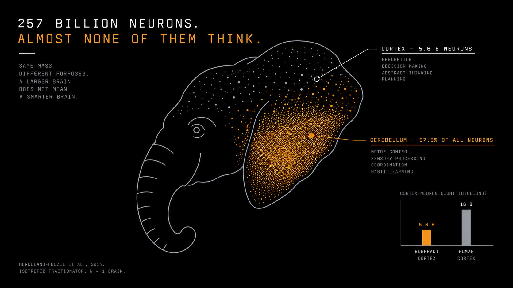

<div align="center">


</div>

# ELEPHANTBRAIN

A terminal for token memory. Paste a contract address and it shows what
the market forgets: who launched it and what happened last time, which
wallets move together around it, which large positions shifted before
price did, and how experienced the wallets involved actually are.

It works as six on-chain checks plus four memory modules. It is not a
simulation of an elephant's brain — that would need a wiring diagram
nobody has. It is built on the one thing the elephant does better than
almost any animal: remembering who is who, across time, even when the
context changes.

```sh
npm run elephant -- <contract>          # the full report
npm run elephant -- --wallet <address>  # one wallet's Matriarch Score
npm run elephant -- --alerts            # recent low-frequency alerts
```

---

## Why an elephant


An adult African elephant's brain weighs 4.5 to 5.5 kg — the specimen
studied in detail, an adult male, 4,618.6 g without the olfactory bulb.
A human brain weighs about 1.4 kg.


A sperm whale's weighs 7.8 kg and does not outperform a human on anything
we know how to test. Mass is where the question starts, not the answer.



The elephant carries roughly 257 billion neurons, three times a human's —
but 97.5% of them sit in the cerebellum, which coordinates movement,
timing and the senses. The cortex holds 5.6 billion, against a human's
16 billion. The count comes from one brain, in one study.


What the elephant is known for is memory of individuals. In playback
experiments at Amboseli, herds led by older matriarchs told familiar calls
from strangers' more reliably than herds led by younger ones. The
matriarch's value to the herd is what she has stored.


And they appear to address each other with calls that work like names:
a label the caller picks for a specific individual, which that individual
answers more strongly than calls meant for others.


The fruit fly's brain has been mapped completely. The cat's cortex has a
partial map, area by area. The elephant has neuron counts and nothing
else — no connectome. A random graph called an elephant brain and made to
glow would have been easy. This project takes the principle instead.

---

## The four modules

| module | the principle |
|:--|:--|
| [Deployer Memory](modules/deployer-memory.md) | Recognising an individual, even under a new name. |
| [Herd Map](modules/herd-map.md) | Knowing who travels with whom. |
| [Low-Frequency Alerts](modules/low-frequency-alerts.md) | Hearing what travels below ordinary attention. |
| [Matriarch Score](modules/matriarch-score.md) | Experience, as a number that draws attention. |

Each page covers what the module reads, how it decides, and what it will not claim.

---

## Where the data comes from

Every scan feeds it. Early buyers the scanner sees become `buy` rows in
`wallet_activity`, in the block the bundle landed in. That alone is enough
for Deployer Memory's crew links and for Herd Map.

Two things need more than a scan, and this is said plainly:

- **Funding links** need a transaction-history provider, which is not wired
  in yet. Until it is, add them by hand or from your own source:
  `npm run elephant -- --fund <wallet> <funder> --chain base`, or
  `POST /api/elephant/funding`. Each link records its `source`.
- **Alerts** need amounts. A scan sees who bought, not for how much. Feed
  movements with USD values through `POST /api/elephant/activity` from any
  source you trust.

Wallet age is the first time memory saw the address unless an on-chain
first-transaction time is stored in `chain_first_tx_at`. The report always
says which.

---

## API

```
GET  /api/elephant/:chain/:address   the full report (404 if memory has not seen it)
GET  /api/elephant/wallet/:address   Matriarch Score
GET  /api/elephant/alerts?token=     recent alerts
POST /api/elephant/activity          { wallet, token, chain, side, block, amountUsd, liquidityUsd }
POST /api/elephant/funding           { wallet, funder, chain, amountUsd, source }
```

`side` is one of `buy`, `sell`, `add_lp`, `remove_lp`.

---

## What it does not do

```
It does not predict prices.
It does not guarantee safety.
It does not simulate neural activity.
A fresh wallet has no history. Nothing on chain fixes that on day one.
Links and clusters are evidence to look at, not verdicts.
It remembers what the market forgets. That is all it claims.
```

---

## Sources

- Herculano-Houzel, S. et al. (2014). The elephant brain in numbers. *Frontiers in Neuroanatomy*, 8:46.
- McComb, K. et al. (2001). Matriarchs as repositories of social knowledge in African elephants. *Science*, 292(5516), 491–494.
- Pardo, M. et al. (2024). African elephants address one another with individually specific name-like calls. *Nature Ecology & Evolution*.
- Plotnik, J., de Waal, F. B. M. & Reiss, D. (2006). Self-recognition in an Asian elephant. *PNAS*, 103(45), 17053–17057.
- FlyWire Consortium (2024). Whole-brain connectome of adult *Drosophila melanogaster*. *Nature*.
